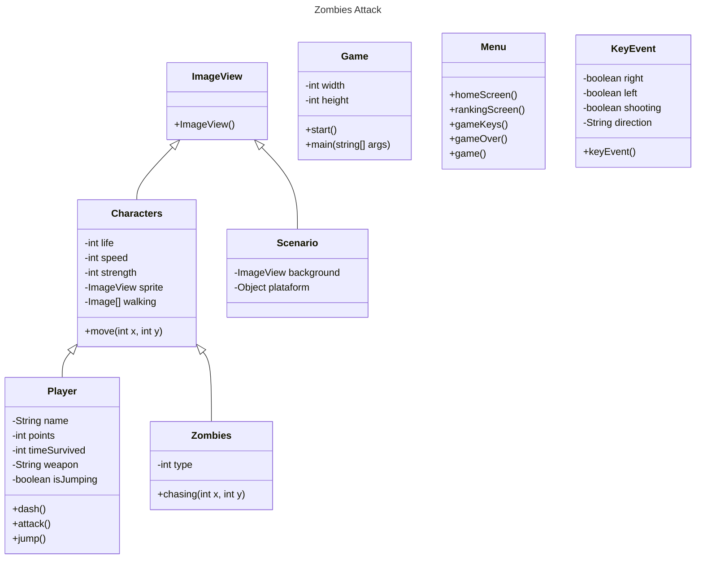

    
# Zombies Attack

  

    

    

## Index
- [About](#about)  
- [Requirements](#requirements)
- [Game Classes](#game-classes)
- [User Flow](#user-flow) 
- [Story](#story)  
- [Game Objective](#game-objective)  
- [Commands](#commands)  
- [Sound Effects](#sound-effects)  
- [Contribution](#contribution)  

## Requirements

- Java IDE like IntelliJ or Eclipse (used IntelliJ for development),  
- java 22(jdk 22.0.1),  
- java.fx,  
- Libraries:  
    - javafx.application.Application;  
    - javafx.scene.Scene;  
    - javafx.scene.layout.Pane;  
    - javafx.stage.Stage;  
    - javafx.animation.*;  
    - javafx.scene.image.Image;  
    - javafx.scene.image.ImageView;  
    - javafx.util.Duration;  
    - java.util.ArrayList;  
    - java.util.Objects;  
    - import javafx.animation.KeyFrame;  
    - javafx.animation.PauseTransition;  
    - javafx.geometry.Pos;  
    - javafx.scene.control.Button;  
    - javafx.scene.layout.HBox;  
    - javafx.scene.layout.VBox;  
    - javafx.scene.text.Text;  
    - javafx.scene.input.KeyCode;  

## Game Classes

## User Flow

 
    
### Home Screen  

## About

This game project was developed by students coursing System Analisys and Development at Faculdade SENAI Gaspar Ricardo Junior, with 2rpnet support.

Start date: 06/10/2024.

End date: to be defined.

## Story

During a zombie apocalypse, Indiana Grimes was the only one from his city that survived. Trying to find someone else or at least a single life, 
he runs the world fighting lots of types of zombies using his knife and wapons that he finds along the way.  

Zombies:  
    - Short zombies are fast, have low life and a medium hit,
      
    - Medium zombies have a medium speed, medium life and a weak hit,
      
    - Tall zombies are the slowest one, have the biggest life and the strongest hit.
      

Indiana Grimes:
  
    - Inspired by Rick Grimes from The Walking Dead and Indiana Jones. Indiana Grimes fights to survive the zombie apocalypse using a variety of weapons.
    

## Game Objective

The game works in rounds, at start the survivor has a knife to fight, by killing zombies he gets more points that allows him to use better weapons. Only the five best that reach more points can appear at the ranking.

Ranking:  
    - Each zombie has different point rewards from killing them,  
    - Player weapon change by reaching especific points,  
    - Indiana Grimes has 10 hits of life, if it turns 0 = GAME OVER,  
    - After GAME OVER screen, player can send his name to ranking, only the top 5 appears at ranking screen.

## Commands
    - A = LEFT, and UP at menu,
    - D = RIGHT, and DOWN at menu,

    - F = ATTACK, and CONFIRM at menu.    

    

## Sound Effects

In this project we use some sound effects to enrich the player's experience when interacting with the objects of game.

Sources used to obtain the files:

- [Pixabay](#https://pixabay.com/pt/sound-effects/)
- [Mixkit](#https://mixkit.co/free-sound-effects/)

## Contribution

<table>
  <tr>
    <td align="center">
      <a href="https://github.com/llei7e">
         
        
          <b>Lucas Leite</b>
        
      </a>
    </td>
    <td align="center">
      <a href="https://github.com/Giovani-RodriguesS">
         
        
          <b>Giovani Rodrigues</b>
        
      </a>
    </td>
    <td align="center">
      <a href="https://github.com/mwlaofr">
         
        
          <b>Millena França</b>
        
      </a>
    </td>
    <td align="center">
      <a href="https://github.com/DarkBytess">
         
        
          <b>Luis Henrique</b>
        
      </a>
    </td>
  </tr>
</table>

