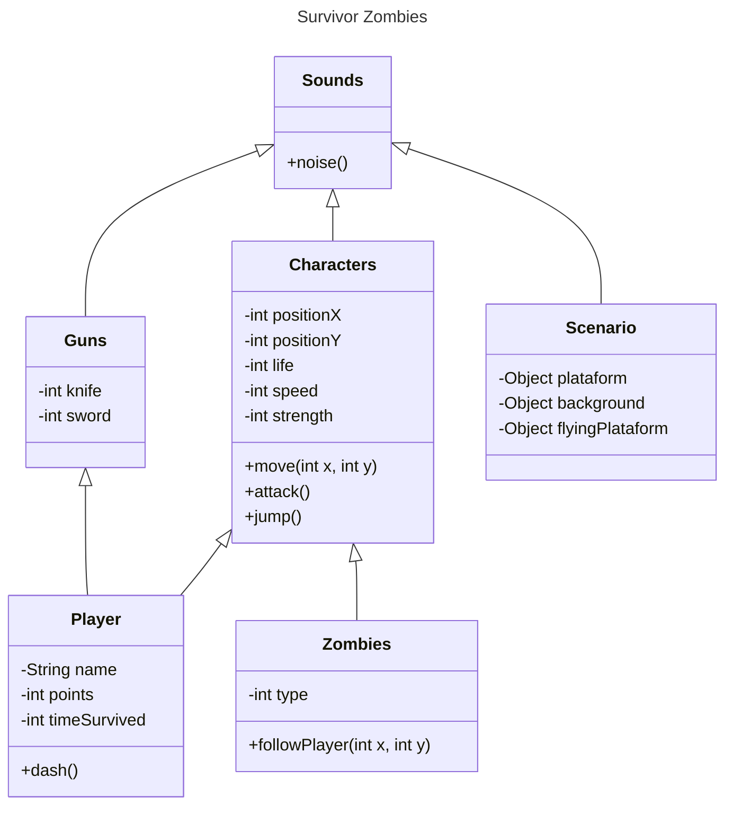

# Clueless - Zombies Attack

*(Breve descrição do projeto aqui.)*
## Index
- [About](#about)
    - [Game Classes](#game-classes)
    - [Sound Effects](#sound-effects)
- [Requirements](#requirements)
- [Contribution](#Contribution)

## Game Classes

## Sound Effects

In this project we use some sound effects to enrich the player's experience when interacting with the objects of game.

Sources used to obtain the files:

- [Pixabay](#https://pixabay.com/pt/sound-effects/)
- [Mixkit](#https://mixkit.co/free-sound-effects/)