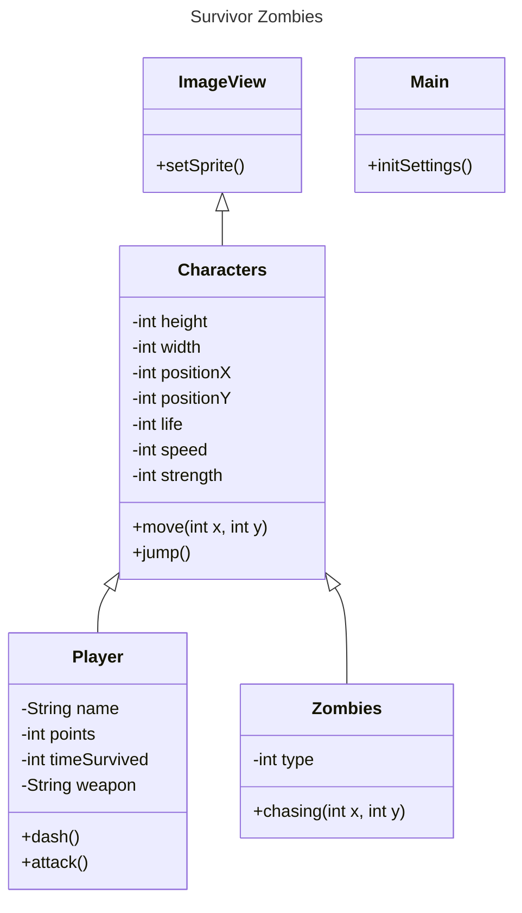

# Clueless - Zombies Attack

[game Image]

## Index
- [About](#about)
    - [Story](#-_story)
    - [Game Objective](#-_game-objective)
    - [Commands](#-_commands)
- [Game Classes](#game-classes)
- [Sound Effects](#sound-effects)
- [Requirements](#requirements)
- [Contribution](#contribution)

## About

This game project was developed from students coursing System Analisys and Development at Faculdade SENAI Gaspar Ricardo Junior, with 2rpnet support.
It was developed using *java 22, java.fx, java.fxgl, java.bootstrap, java.controls managed with maven.*

Start date: 06/10/2024.

End date: to be defined.

### - History

During a zombie apocalypse, Indiana Grimes was the only one from his city that survived. Trying to find someone else or at least a single life, 
he runs the world fighting lots of types of zombies using his knife and wapons that he finds along the way.

### - Game Objective

The game works in rounds, at start the survivor have a knife to fight, he can get better weapons with the points he gets by killing zombies.

Zombies:
    - Short zombies are fast, have low life and a medium hit,
    - Medium zombies have a medium speed, medium life and a weak hit,
    - Short zombies are low, have higher life and a strong hit.

Ranking:
    - Each zombie has different point rewards from killing them,
    - Player can buy weapons each 5 rounds based on your points,
    - Indiana Grimes has 10 hits of life, if it turns 0 = GAME OVER,
    - After GAME OVER screen, player can send his name to ranking, only the top 5 appears at ranking screen.

### - Commands
    - A = LEFT, and UP at menu,
    - D = RIGHT, and DOWN at menu,

    - F = ATTACK, and CONFIRM at menu.    

    [commands IMAGE]

## Game Classes

## Sound Effects

In this project we use some sound effects to enrich the player's experience when interacting with the objects of game.

Sources used to obtain the files:

- [Pixabay](#https://pixabay.com/pt/sound-effects/)
- [Mixkit](#https://mixkit.co/free-sound-effects/)

## Requirements

java 22,

java.fx,

controls.fx,

bootstrap,

fxgl;

## Contribution

<table>
  <tr>
    <td align="center">
      <a href="https://github.com/llei7e">
         
        
          <b>Lucas Leite</b>
        
      </a>
    </td>
    <td align="center">
      <a href="https://github.com/Giovani-RodriguesS">
         
        
          <b>Giovani Rodrigues</b>
        
      </a>
    </td>
    <td align="center">
      <a href="https://github.com/mwlaofr">
         
        
          <b>Millena França</b>
        
      </a>
    </td>
    <td align="center">
      <a href="https://github.com/DarkBytess">
         
        
          <b>Luis Henrique</b>
        
      </a>
    </td>
  </tr>
</table>
